# Desafio Fullstack - Gestão Financeira

Este projeto é uma solução completa para o desafio de desenvolvimento de um sistema de gestão financeira pessoal. A aplicação permite aos usuários cadastrar receitas e despesas, gerenciar transações e visualizar o fluxo de caixa mensal.

## Tecnologias Utilizadas

- **Backend:** NestJS, TypeORM
- **Frontend:** Next.js 14, React, Tailwind CSS
- **Banco de Dados:** PostgreSQL
- **Containerização:** Docker

---

## 🚀 Como Rodar o Projeto

Este projeto é totalmente containerizado, então tudo que você precisa é ter o Docker e o Docker Compose instalados em sua máquina.

### Pré-requisitos

- [Docker](https://www.docker.com/get-started)
- [Docker Compose](https://docs.docker.com/compose/install/) (geralmente já vem com o Docker Desktop)

> [!TIP]
> Você pode usar qualquer sistema operacional, seja ele **Windows**, **macOS** ou **Linux**.\
> Essa é a magia do **Docker** 🐳

### Passo a Passo

1.  **Clone o repositório:**

    ```bash
    git clone [https://github.com/hiag0liveira/Gestao_Financeira.git](https://github.com/hiag0liveira/Gestao_Financeira.git)
    cd Gestao_Financeira
    ```

2.  **Crie o arquivo de ambiente:**
    Duplique o arquivo de exemplo `.env.example` e renomeie a cópia para `.env`. Os valores padrão já estão configurados para um ambiente de desenvolvimento.

    ```bash
    cp .env.example .env
    ```

3.  **Suba os containers:**
    Abra seu terminal na raiz do projeto e execute o seguinte comando:

    ```bash
    docker compose up --build
    ```

> [!NOTE]
> Dependendo da sua versão do Docker, o comando pode ser `docker-compose` (com hífen). Se `docker compose` não funcionar, tente a versão com hífen:
>
> ```bash
> docker-compose up --build
> ```

4.  **Pronto!** A aplicação estará disponível nos seguintes endereços:
    - **Frontend (Next.js):** http://localhost:3001
    - **Backend (NestJS):** http://localhost:3000
    - **Documentação da API (Swagger):** http://localhost:3000/api

> [!WARNING]
> O argumento `--build` é necessário apenas na primeira vez ou quando você instalar novas dependências. Para as próximas vezes, você pode usar apenas `docker compose up`.

---

## 💡 Explicação das Decisões Técnicas

Este projeto foi desenvolvido com foco em boas práticas de arquitetura, escalabilidade e na experiência do programador (DevEx).

### Estrutura Geral

- **Monorepo e Docker:** A escolha de uma estrutura de monorepo com `frontend` e `backend` separados, orquestrados por `Docker Compose`, foi feita para garantir um ambiente de desenvolvimento consistente, replicável e isolado, eliminando problemas de configuração entre diferentes máquinas.

### Backend (NestJS)

- **Arquitetura Modular:** A API foi dividida em módulos (`Auth`, `Users`, `Transactions`, `Categories`, `Balance`) para garantir a separação de responsabilidades e facilitar a manutenção.
- **Funcionalidades Avançadas:** Para ir além dos requisitos básicos, foram implementadas funcionalidades como um **CRUD completo de Categorias**, permitindo uma melhor organização para o utilizador. Além disso, as rotas de listagem foram aprimoradas com **filtros por intervalo de datas (`date range`)** e **paginação**, garantindo que a API seja performática e flexível.
- **Segurança com JWT em Cookies:** A autenticação é baseada em JSON Web Tokens. Para uma maior segurança contra ataques XSS, o token é gerido através de **cookies**, em vez de `localStorage`. As rotas são protegidas por `Guards`, garantindo que um utilizador só possa aceder aos seus próprios dados.
- **TypeORM e `synchronize`:** Para acelerar o desenvolvimento, a opção `synchronize: true` foi utilizada, permitindo que as entidades do código modelem o banco de dados automaticamente. Num ambiente de produção, esta opção seria desativada em favor de um sistema de `Migrations`.
- **Documentação com Swagger:** A API é autodocumentada utilizando OpenAPI (Swagger), o que facilita os testes e a integração.

### Frontend (Next.js)

- **Next.js App Router:** A escolha pelo App Router do Next.js permite uma estrutura de rotas moderna e o uso de layouts aninhados, como a separação entre as áreas de autenticação `(auth)` e a aplicação principal `(main)`.
- **UI e Gráficos:** Para a interface, foi utilizado o **shadcn/ui** sobre o Tailwind CSS. Os gráficos foram construídos com **Recharts**, a biblioteca base dos componentes de gráficos do shadcn, garantindo uma integração visual perfeita e a criação de dashboards interativos.
- **Gerenciamento de Estado:** Para o estado global (dados do utilizador, controlo da UI), foi utilizada a **Context API** nativa do React, que é ideal para a escala deste projeto e evita a complexidade de bibliotecas externas.
- **Comunicação com API:** A comunicação com o backend é gerida pelo **Axios**, configurado com um `interceptor` para centralizar a lógica e adicionar automaticamente o token de autenticação JWT a todas as requisições protegidas.
- **Formulários Robustos:** A combinação de **React Hook Form** e **Zod** garante formulários performáticos e com uma validação de dados segura e totalmente tipada.

---

## 🖼️ Capturas de Tela do Sistema

### Páginas de Autenticação (Modo Claro e Escuro)

|                   Login (Claro)                    |                     Login (Escuro)                      |
| :------------------------------------------------: | :-----------------------------------------------------: |
| 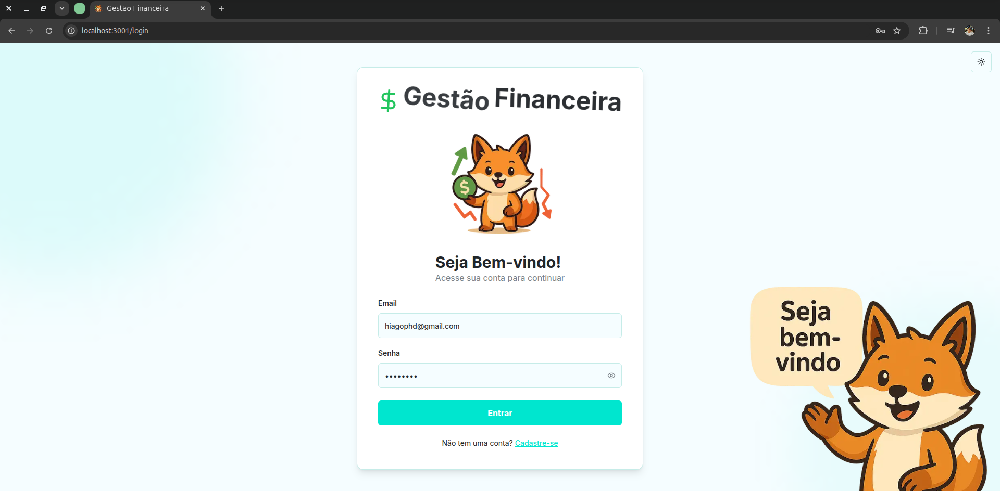 | 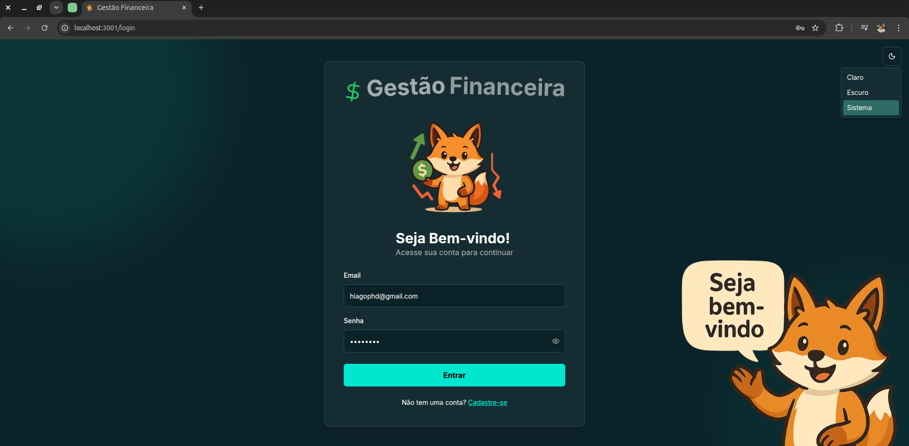 |

|                  Cadastro                  |                                 Validação de Erros                                  |
| :----------------------------------------: | :---------------------------------------------------------------------------------: |
| 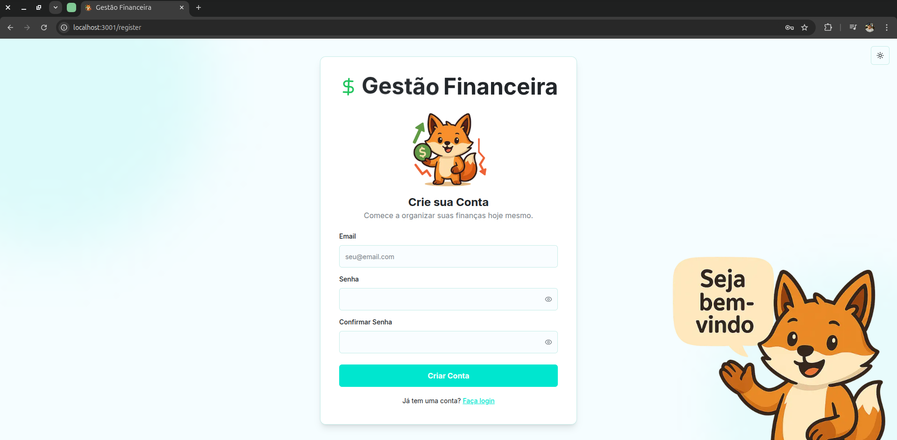 | 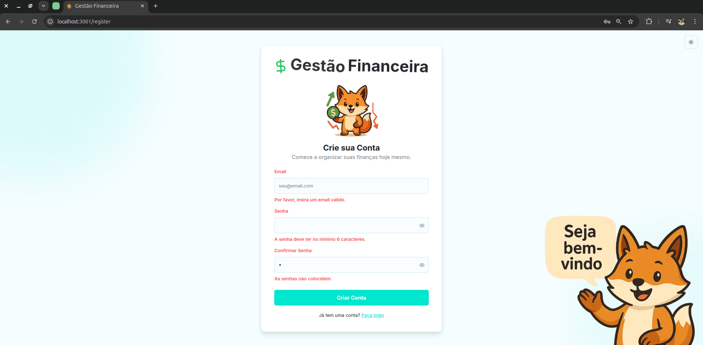 |

### Dashboard Principal (Modo Claro e Escuro)

|                     Dashboard (Claro)                     |                       Dashboard (Escuro)                        |
| :-------------------------------------------------------: | :-------------------------------------------------------------: |
| 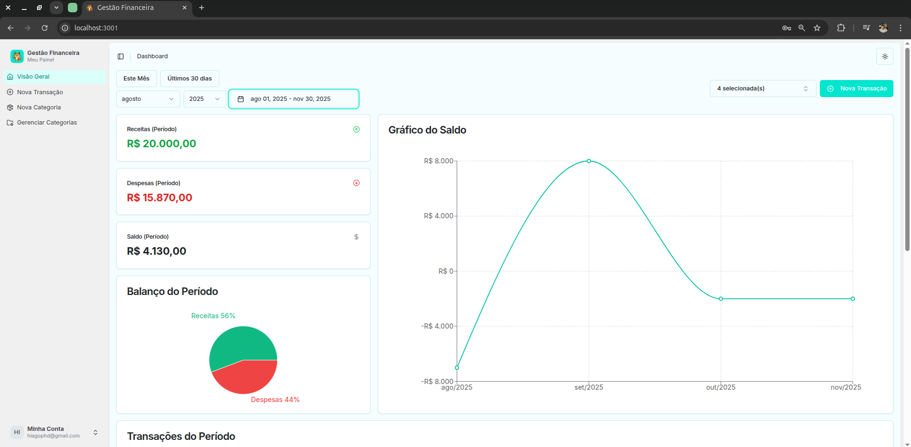 | 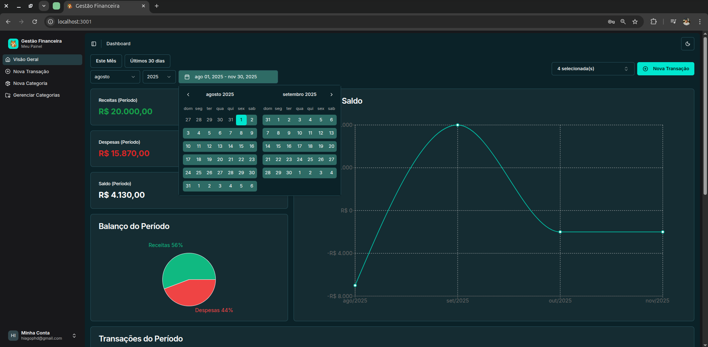 |

### Funcionalidades do Dashboard

|                        Tabela de Transações                         |                        Modal de Nova Transação                         |                       Modal de Nova Categoria                        |
| :-----------------------------------------------------------------: | :--------------------------------------------------------------------: | :------------------------------------------------------------------: |
| 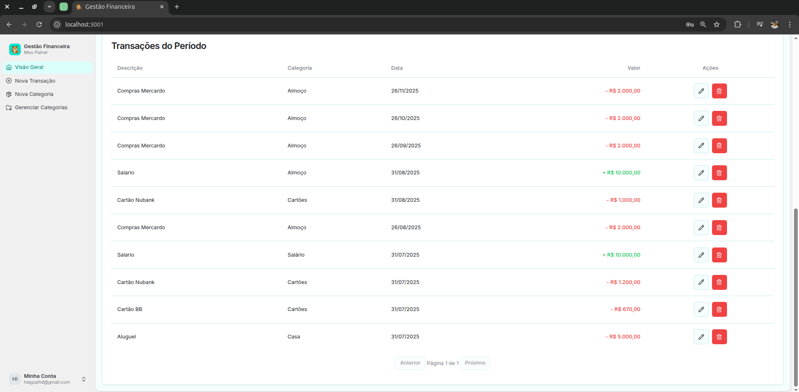 | 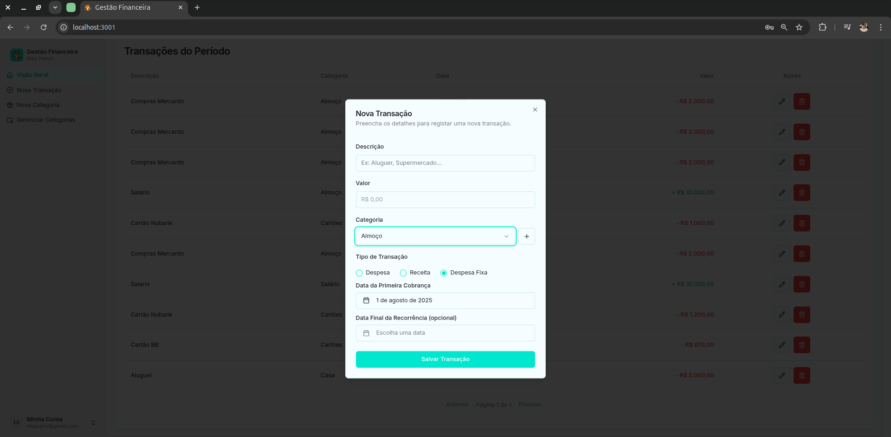 | 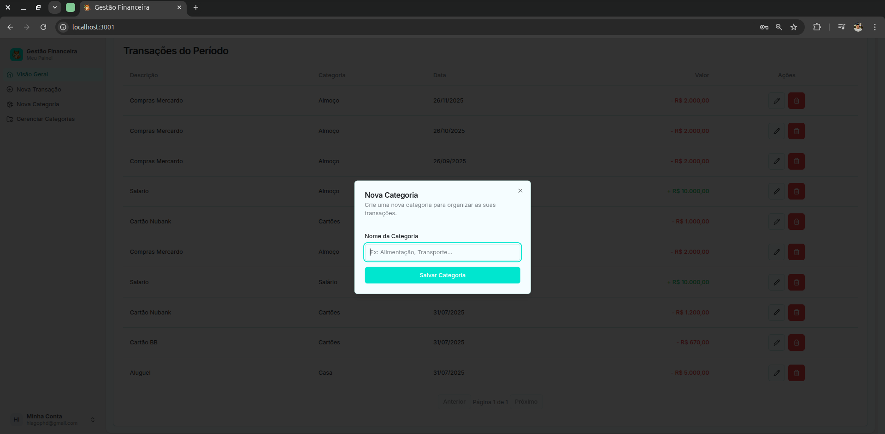 |

---

## 🏛️ Diagramas de Arquitetura

Para uma melhor compreensão da estrutura e do fluxo do sistema, abaixo estão alguns diagramas que ilustram a arquitetura do projeto.

### Diagrama de Caso de Uso

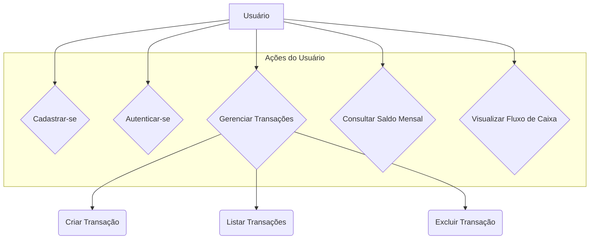

### Diagrama de Componentes

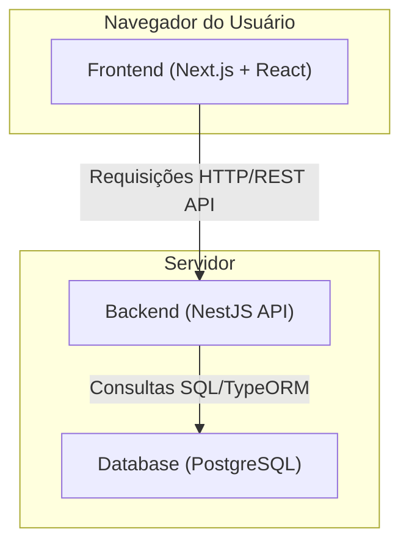

### Diagrama de Sequência (Fluxo Completo: Login e Criação de Transação)

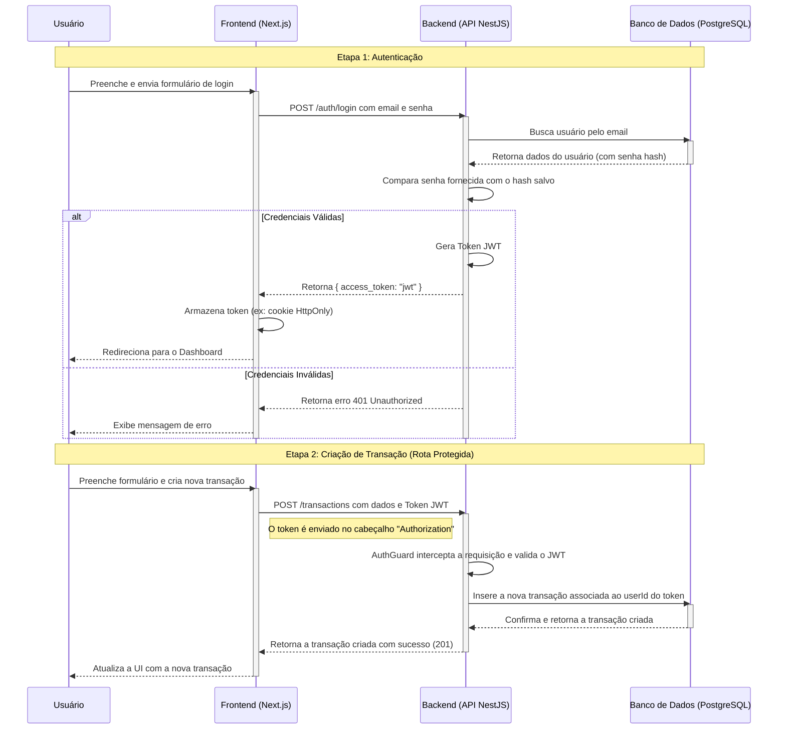

---
