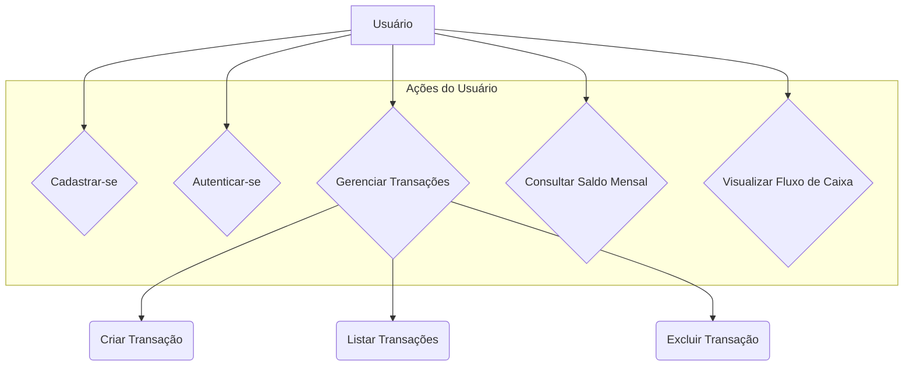
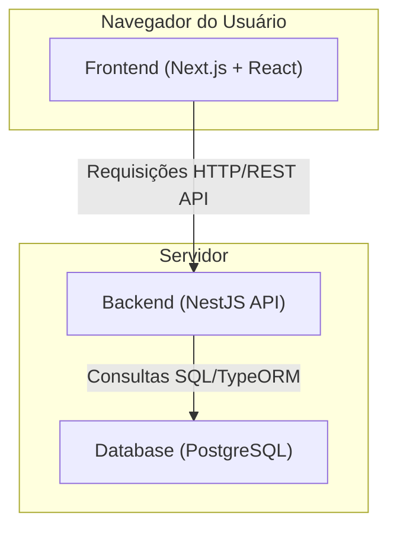
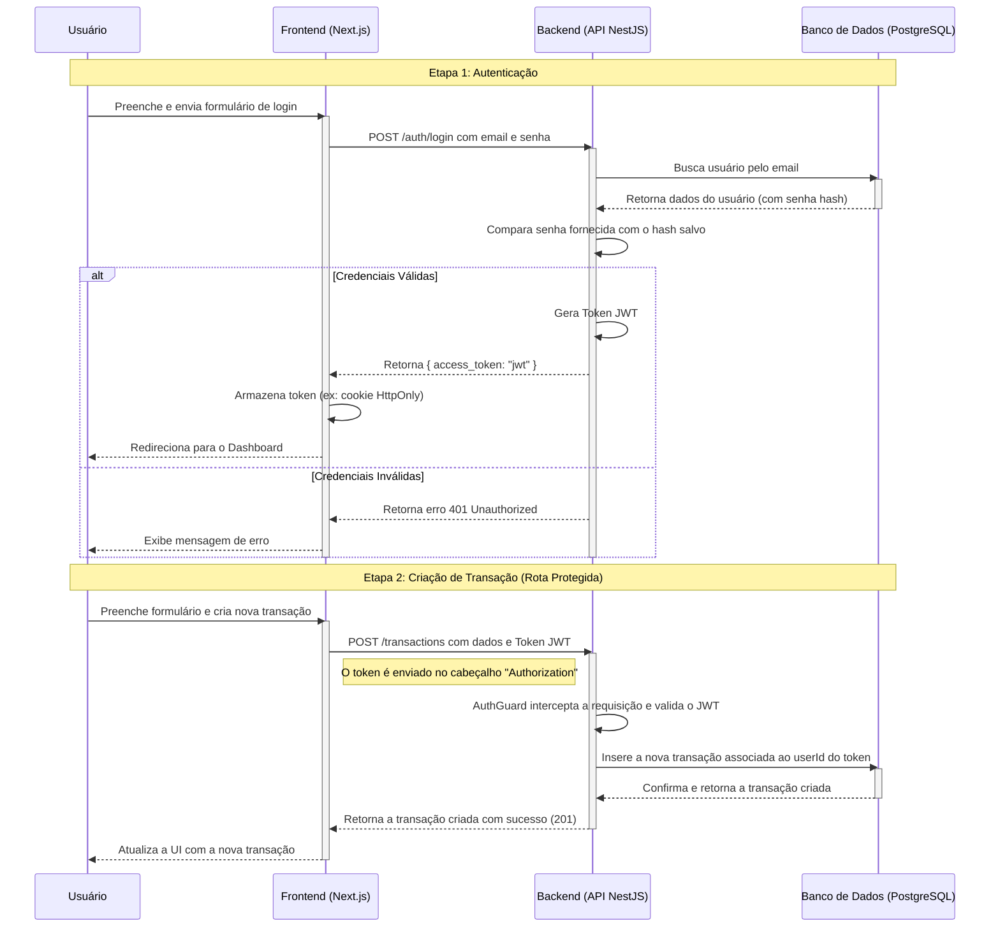

# Desafio Fullstack - Gestão Financeira

Este projeto é uma solução completa para o desafio de desenvolvimento de um sistema de gestão financeira pessoal. A aplicação permite aos usuários cadastrar receitas e despesas, gerenciar transações e visualizar o fluxo de caixa mensal.

## Tecnologias Utilizadas

- **Backend:** NestJS, TypeORM
- **Frontend:** Next.js 14, React, Tailwind CSS
- **Banco de Dados:** PostgreSQL
- **Containerização:** Docker

---

## 🚀 Como Rodar o Projeto

Este projeto é totalmente containerizado, então tudo que você precisa é ter o Docker e o Docker Compose instalados em sua máquina.

### Pré-requisitos

- [Docker](https://www.docker.com/get-started)
- [Docker Compose](https://docs.docker.com/compose/install/) (geralmente já vem com o Docker Desktop)

> [!TIP]
> Você pode usar qualquer sistema operacional, seja ele **Windows**, **macOS** ou **Linux**.\
> Essa é a magia do **Docker** 🐳

### Passo a Passo

1.  **Clone o repositório:**

    ```bash
    git clone [https://github.com/hiag0liveira/Gestao_Financeira.git](https://github.com/hiag0liveira/Gestao_Financeira.git)
    cd Gestao_Financeira
    ```

2.  **Crie o arquivo de ambiente:**
    Duplique o arquivo de exemplo `.env.example` e renomeie a cópia para `.env`. Os valores padrão já estão configurados para um ambiente de desenvolvimento.

    ```bash
    cp .env.example .env
    ```

3.  **Suba os containers:**
    Abra seu terminal na raiz do projeto e execute o seguinte comando:

    ```bash
    docker compose up --build
    ```

    > [!NOTE]
    > Dependendo da sua versão do Docker, o comando pode ser `docker-compose` (com hífen). Se `docker compose` não funcionar, tente a versão com hífen:
    >
    > ```bash
    > docker-compose up --build
    > ```

4.  **Pronto!** A aplicação estará disponível nos seguintes endereços:
    - **Frontend (Next.js):** http://localhost:3001
    - **Backend (NestJS):** http://localhost:3000

> [!WARNING]
> O argumento `--build` é necessário apenas na primeira vez ou quando você instalar novas dependências. Para as próximas vezes, você pode usar apenas `docker compose up`.

---

## 🏛️ Diagramas de Arquitetura

Para uma melhor compreensão da estrutura e do fluxo do sistema, abaixo estão alguns diagramas que ilustram a arquitetura do projeto.

### Diagrama de Caso de Uso



### Diagrama de Componentes



### Diagrama de Sequência (Fluxo Completo: Login e Criação de Transação)



---

> [!IMPORTANT]
> A organização e o desenvolvimento das funcionalidades devem seguir as tarefas definidas no quadro Kanban do projeto no GitHub. Isso garante que todos os requisitos do desafio sejam atendidos de forma organizada ⚡️
